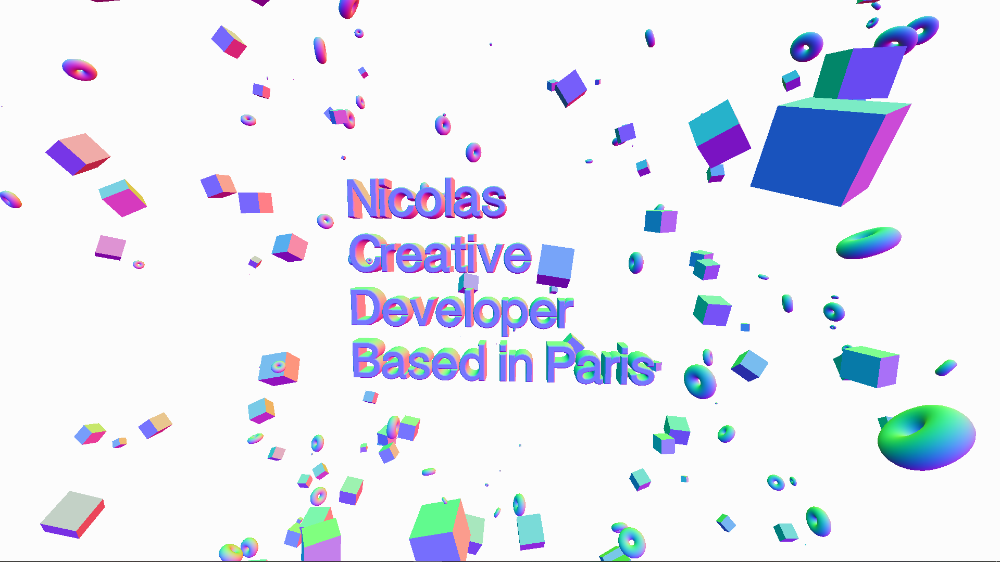

# 3D-Text

I re-create what ilithya did with her cool [portfolio](https://www.ilithya.rocks/) and have a big 3D text in the middle of the scene with objects floating around.

Exercice from threejs-journey(https://threejs-journey.xyz/) by [Bruno Simon](https://github.com/brunosimon) to learn [three.js](https://threejs.org/)

In the project directory, you can run:

### `yarn run install`

Then the following command

### `yarn run dev`

Runs the app in the development mode.\
Open [http://localhost:8080](http://localhost:8080) to view it in the browser.

